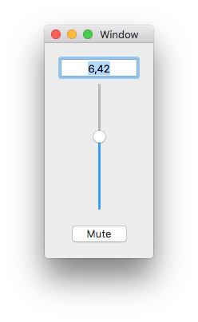

# SwiftSound

SwiftSound is a project focused on exploring Xcode, the Swift programming language, and OS X application development.

The app is made based on the [Apple Developers][] tutorial on creating your [first mac app][]. However a few additional features have been added, and the app has been programmed in [swift][] rather than [objective-c][].

[apple developers]: https://developer.apple.com "Apple Developers"
[first mac app]: https://developer.apple.com/library/mac/referencelibrary/GettingStarted/RoadMapOSX/books/RM_YourFirstApp_Mac/Articles/Introduction.html "Your First Mac App - Apple Developers"
[swift]: https://developer.apple.com/swift/ "The swift programming language"
[objective-c]: https://developer.apple.com/library/mac/documentation/Cocoa/Conceptual/ProgrammingWithObjectiveC/Introduction/Introduction.html "The Objective-C programming language"

The functionality of the app is very simple, it plays a sound loop, which can be adjusted in volume by a slider, a text field, or a mute button, as seen here.

## License

All the code in project is licensed under the MIT License.

In brief this means you can do anything you want with the software. Have fun!

See the [full MIT license][] for the details.

The audio file "[beatbox.mp3][]", and image "[image.png][]" are licensed under the [creative commons attribution 4.0][] license.

[beatbox.mp3]: SwiftSound/SwiftSound/beatbox.mp3

[image.png]: image.png

[full MIT license]: LICENSE "Full License"

[creative commons attribution 4.0]: http://creativecommons.org/licenses/by/4.0/ "Creative Commons Attribution 4.0"
